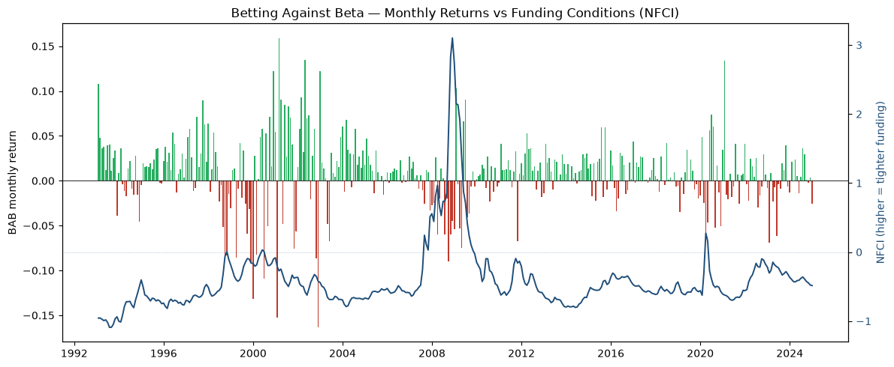

# Betting Against Beta: An Out-of-Sample Replication

A from-scratch replication of Frazzini & Pedersen (2014), *"Betting Against Beta"*,
extended to investigate if its central predictions still hold
out of sample, through the post-2014 low-beta crowding and the COVID funding shock

The BAB factor is built directly from CRSP daily data, and the replicated return series
tracks AQR's published US BAB factor with a **0.96 correlation**.

## Headline results

| Test | Result | vs. paper |
|---|---|---|
| Tracks AQR's published US BAB | **R² = 0.93**, β = 0.99, corr = 0.96 | (external check) |
| Prop 1: SML flatness (CAPM α, P1 vs P10) | +7.1% to -6.0%, monotone | Holds |
| Prop 2: BAB earns risk-adjusted return (FF3+UMD α) | 8.6%, t = 3.11 |Significant Out of Sample|
| BAB Sharpe (1993-2024) | 0.74 | FP full-sample: 0.78 |
| Prop 3: funding tightening to BAB loss (ΔNFCI) | coef -0.053, t = -3.7 | Holds |

### Proposition 1: the security market line is too flat

Ten beta-sorted deciles show CAPM alpha declining almost monotonically from +7.1%/yr
(low beta) to -6.0%/yr (high beta), with Sharpe ratios falling monotonically from 0.91
to 0.31. Under a four-factor model the high-beta underperformance is largely absorbed by
size/value/momentum, so the surviving effect is concentrated in the **low-beta long leg**,
consistent with post-publication crowding of the anomaly.

| Decile | Excess ret | CAPM α | CAPM t-stat | FF4 α | FF4 t-stat | Sharpe |
|---|---|---|---|---|---|---|
| P1 (low β) | 11.9% | +7.1% | 2.92 | +7.1% | 3.79 | 0.91 |
| P2 | 11.6% | +5.4% | 2.26 | +5.6% | 3.18 | 0.81 |
| P3 | 12.5% | +5.4% | 2.49 | +5.4% | 4.08 | 0.82 |
| P4 | 12.1% | +4.1% | 1.94 | +4.3% | 3.34 | 0.74 |
| P5 | 13.6% | +4.5% | 2.16 | +5.0% | 4.27 | 0.76 |
| P6 | 11.9% | +2.1% | 0.96 | +2.9% | 2.56 | 0.61 |
| P7 | 12.1% | +1.4% | 0.61 | +2.7% | 2.15 | 0.57 |
| P8 | 11.3% | -0.8% | -0.33 | +1.7% | 1.15 | 0.46 |
| P9 | 11.3% | -2.6% | -0.94 | +1.3% | 0.72 | 0.40 |
| P10 (high β) | 12.1% | -6.0% | -1.46 | +0.3% | 0.09 | 0.31 |

### Proposition 2: BAB earns significant risk-adjusted returns

The market-neutral BAB factor (long low-beta levered to β=1, short high-beta de-levered to
β=1) earns an **8.6% annual FF3+UMD alpha (t = 3.11)**. The realized loadings are
economically sensible: near-zero market beta, a positive value tilt, and positive momentum,
the same tilts FP document. As an external check, the series tracks AQR's published US BAB
factor with R² = 0.93.

| Metric | Value |
|---|---|
| Sharpe | 0.74 |
| CAPM alpha | 11.9%, t = 3.56 |
| FF3+UMD alpha | 8.6%, t = 3.11 |
| Market (mktrf) | -0.09 |
| Size (SMB) | -0.09 |
| Value (HML) | +0.42 |
| Momentum (UMD) | +0.28 |

### Proposition 3: BAB loses when funding conditions tighten

Regressing monthly BAB returns on the Chicago Fed NFCI (a funding-stress proxy; the TED
spread FP used was discontinued with LIBOR), a within-month tightening of conditions
predicts contemporaneous BAB losses, matching FP's Eq. 11. 

| Variable | Coef | t-stat |
|---|---|---|
| Lagged NFCI level | -0.019 | -4.03 |
| Change in NFCI (contemporaneous) | -0.053 | -3.72 |
| R² | 0.078 | |

*Sample: 1993-01 to 2024-12 (n = 384 months).*

If we look to Covid, BAB's worst month in the sample (-6.1%, March 2020)
lands on the sharpest NFCI spike, and the factor rebounds as the Fed eases
conditions through mid-2020.



*Out of scope: Propositions 4 (beta compression) and 5 (constrained-investor holdings) are
deliberately excluded. Prop 4 is a second-order prediction whose effect is marginal even in
the original sample, and Prop 5 requires proprietary holdings data (mutual-fund, brokerage,
and LBO) unavailable here.*

## Method notes

- **Betas** follow FP's methodology: 1-year rolling daily vol times 5-year overlapping
  3-day-return correlation, shrunk `0.6·β + 0.4·1`. A minimum of 750 daily observations is
  required for a correlation, which sets the ~1993 backtest start from a 1990 data pull.
- **Universe:** CRSP common stocks (share codes 10/11) on NYSE/AMEX/NASDAQ, with delisting
  returns folded into the final month to avoid survivorship bias.

## Reproducing

Requires a WRDS account with CRSP access. Raw data is **not** committed (WRDS licensing).

```bash
pip install -r requirements.txt
jupyter lab notebooks/bab_replication.ipynb
```

The first run pulls from WRDS and caches to `data/` as parquet (gitignored); subsequent
runs load from cache. Run the notebook top to bottom.

## Repository

```
src/            data pull, beta estimation, portfolio construction, evaluation
notebooks/      bab_replication.ipynb (the full narrative and results)
tests/          test_betas.py (the beta estimation is the correctness-critical piece)
docs/           figures used in this README
```

## Reference

Frazzini, A., & Pedersen, L. H. (2014). Betting against beta. *Journal of Financial
Economics*, 111(1), 1-25.
